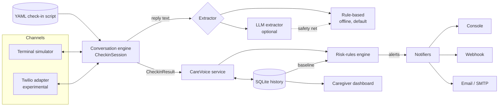

# care-voice

A daily voice check-in for older adults who live alone, with plain-language alerts for the people who look after them.

[](https://github.com/superintelligenceco/care-voice/actions/workflows/ci.yml)
[](https://github.com/superintelligenceco/care-voice/actions/workflows/codeql.yml)
[](LICENSE)
[](pyproject.toml)

> **care-voice is not a medical device and is not for emergencies.** It does not diagnose, treat, or monitor any condition, and it does not contact emergency services. If someone needs urgent help, call your local emergency number.

care-voice asks a short, warm check-in every day: did you sleep, did you take your morning medication, have you eaten, are you in pain, have you had a fall, what day is it, how do you feel. It turns the replies into structured answers, compares them with recent days, and tells a caregiver when something looks off.

## See it work

This is a real run of the terminal simulator with the bundled `examples/replies/concerning-day.txt`:

```text
$ care-voice simulate --name Margaret --replies examples/replies/concerning-day.txt --date 2026-09-30
(care-voice is not a medical device and is not for emergencies. In an emergency, call your local emergency number.)

agent: Good morning, Margaret. This is your daily check-in call. It only takes a couple of minutes. Did you sleep well last night?
  you: Not really, I kept waking up
agent: Have you taken your morning medication?
  you: No, I forgot them
agent: Have you had something to eat today?
  you: Not yet
agent: Are you in any pain today?
  you: Yes, my hip hurts
agent: I'm sorry to hear that. On a scale from 0 to 10, how bad is the pain?
  you: About an eight
agent: Where does it hurt?
  you: My right hip
agent: Have you had a fall or a stumble since we last spoke?
  you: I slipped in the bathroom last night
agent: Just so I have it right, can you tell me what day of the week it is today?
  you: Is it Sunday?
agent: Last one. From 1 to 5, where 5 is wonderful, how are you feeling today?
  you: Pretty low today
agent: Thank you, Margaret. That's everything for today. Have a lovely day, and I'll call again tomorrow.

--- check-in completed (1 attempt(s)) ---
answers:
  slept_well   no
  took_meds    no
  has_eaten    no
  in_pain      yes  flags: pain
  pain_level   8
  pain_where   My right hip
  had_fall     yes  flags: fall
  day_of_week  sunday
  mood         2
alerts:
  [HIGH] FALL_REPORTED: Margaret reported a fall.
      - answered yes to the fall question: "I slipped in the bathroom last night"
  [HIGH] MISSED_MEDS: Margaret has not taken their morning medication.
      - said: "No, I forgot them"
  [HIGH] PAIN_REPORTED: Margaret reported severe pain.
      - reported pain: "Yes, my hip hurts"
      - pain level 8/10
      - location: My right hip
  [MEDIUM] POSSIBLE_CONFUSION: Margaret showed 1 sign(s) of possible confusion.
      - gave the wrong day: "Is it Sunday?" (today is Wednesday)
  [LOW] LOW_MOOD: Margaret reported low mood.
      - mood 2/5
  [LOW] NOT_EATEN: Margaret has not eaten yet today.
  [LOW] POOR_SLEEP: Margaret did not sleep well.
```

## Quickstart

You need Python 3.11 or later. No API key, account, or network access is required.

```bash
git clone https://github.com/superintelligenceco/care-voice && cd care-voice
python3 -m venv .venv && . .venv/bin/activate && pip install .
care-voice simulate --name Margaret --replies examples/replies/concerning-day.txt --date 2026-09-30
```

Leave out `--replies` to answer the questions yourself in the terminal.

## Why it exists

Many older adults live alone and want to stay independent. Their families often live far away and rely on a phone call that sometimes does not happen. A short, predictable call each morning catches the small things early: a missed dose, a fall nobody mentioned, a slow slide in mood, or a morning where the day of the week will not come.

Commercial check-in services exist, but they are closed, and you cannot see how they decide what to escalate. care-voice keeps the whole pipeline readable: the questions are a YAML file, the extractor is a set of documented patterns, and every alert says exactly which reply triggered it.

## Features

- **Scripted conversation engine.** A YAML script defines the questions, answer types (`yes_no`, `scale`, `day_of_week`, `text`), re-prompts, and follow-ups. The engine re-asks unclear answers and ends gracefully after repeated silence.
- **Offline extractor by default.** A deterministic, rule-based extractor understands common ways of saying yes, no, numbers, feelings, and weekdays. It is conservative: when a reply is ambiguous, it reports "unclear" instead of guessing.
- **Optional LLM extractor.** Point care-voice at any OpenAI-compatible chat completions endpoint for better understanding of free-form replies. The rule-based extractor still runs underneath, so a model can add signal but never hide an emergency keyword.
- **Risk-rules engine.** Ten built-in rules produce alerts with a severity and the exact reasons. See [Alert rules reference](#alert-rules-reference).
- **Baselines from local history.** Every check-in is stored in SQLite, so rules compare today's mood with the person's own recent average and count consecutive missed calls.
- **Notifiers.** Console, webhook (JSON, optionally HMAC-SHA256 signed), and email over SMTP. Each notifier has its own minimum severity.
- **Terminal simulator.** Try a check-in interactively or replay a file of replies.
- **Caregiver dashboard.** A small web page, served by the app, that lists recent check-ins and alerts, plus a JSON API.
- **Telephony adapter interface (experimental).** A documented `VoiceAdapter` protocol and a Twilio Programmable Voice implementation with signed webhooks and retries.

## Architecture



| Module | Responsibility |
| --- | --- |
| `care_voice.script` | Loads and validates YAML check-in scripts. |
| `care_voice.engine` | Runs one check-in turn by turn, with re-prompts, follow-ups, silence handling, and call retries. |
| `care_voice.extractors` | The `Extractor` interface, the rule-based extractor, and the LLM extractor. |
| `care_voice.risk` | The rules that turn a check-in and its history into alerts. |
| `care_voice.store` | SQLite storage for check-ins, transcripts, and alerts. |
| `care_voice.notifiers` | Console, webhook, and email delivery. |
| `care_voice.service` | Wires storage, rules, and notifiers together. |
| `care_voice.dashboard` | The caregiver web page and JSON API, built on the standard library. |
| `care_voice.telephony` | The `VoiceAdapter` interface and the experimental Twilio adapter. |

The core only ever sees text. Speech recognition and text-to-speech stay with the voice provider, so the extractor and the rules behave the same in the simulator and on a real call.

## Usage

```bash
care-voice simulate [--config FILE] [--replies FILE] [--date YYYY-MM-DD] [--no-answer]
care-voice history  [--config FILE]     # recent check-ins
care-voice alerts   [--config FILE]     # recent alerts
care-voice validate [--config FILE] [--script FILE]
care-voice serve    [--config FILE] [--host HOST] [--port PORT] [--twilio]
care-voice call     [--config FILE] [--to +15555550100]   # experimental
```

To run the dashboard in Docker:

```bash
docker compose up --build
```

Then open <http://127.0.0.1:8080/>. Set `CARE_VOICE_DASHBOARD_PASSWORD` to require HTTP basic authentication.

## Configuration

Copy [`examples/care-voice.yaml`](examples/care-voice.yaml) and pass it with `--config`. Every key is optional. Secrets never go in the file: keys ending in `_env` name the environment variable that holds the secret.

| Key | Default | Meaning |
| --- | --- | --- |
| `person.name` | `friend` | The name the agent uses. |
| `person.timezone` | `UTC` | IANA time zone, used for the day-of-week question. |
| `person.phone` | empty | E.164 number for the experimental telephony adapter. |
| `script` | `default` | `default` or a path to your own YAML script. |
| `database` | `care-voice.db` | SQLite file. Relative paths resolve against the config file. |
| `checkin.max_reprompts` | `1` | How many times to re-ask an unclear answer. |
| `checkin.max_silences` | `3` | Silences in a row before the check-in ends as incomplete. |
| `checkin.call_attempts` | `3` | Tries before a check-in is recorded as unanswered. |
| `checkin.retry_delay_minutes` | `10` | Wait between telephony attempts. |
| `extractor.kind` | `rules` | `rules` or `llm`. |
| `extractor.base_url`, `model`, `api_key_env` | none | Settings for the LLM extractor. |
| `rules.*` | see below | Thresholds for the alert rules. |
| `notifiers` | console | A list of `console`, `webhook`, or `email` notifiers, each with `min_severity`. |
| `dashboard.host`, `dashboard.port` | `127.0.0.1`, `8080` | Where `care-voice serve` listens. |
| `telephony.*` | none | Twilio settings. See [Telephony](#telephony-experimental). |

### Custom scripts

A script is a list of questions. The alert rules find answers by question id, so keep the ids `slept_well`, `took_meds`, `has_eaten`, `in_pain`, `pain_level`, `had_fall`, `day_of_week`, and `mood` if you want the matching rules to apply. See [`examples/gentle-evening-script.yaml`](examples/gentle-evening-script.yaml) and the bundled [`default_script.yaml`](src/care_voice/data/default_script.yaml). Check a script with `care-voice validate --script my-script.yaml`.

### Webhook payload

```json
{
  "person": "Margaret",
  "checkin_id": 12,
  "checkin_status": "completed",
  "started_at": "2026-09-30T09:00:00+01:00",
  "alerts": [
    {
      "code": "FALL_REPORTED",
      "severity": "high",
      "message": "Margaret reported a fall.",
      "reasons": ["answered yes to the fall question: \"I slipped in the bathroom last night\""]
    }
  ]
}
```

When `secret_env` is set, each request carries `X-Care-Voice-Signature: sha256=<hex>`, an HMAC-SHA256 of the raw body.

## Alert rules reference

| Code | Severity | Triggers when |
| --- | --- | --- |
| `EMERGENCY_WORDS` | critical | Any reply contains phrases such as "help me", "can't breathe", "chest pain", "can't get up", or "on the floor". The agent also tells the person to call their local emergency number. |
| `NO_ANSWER` | high, critical on a streak | Nobody answers after `checkin.call_attempts` tries. Critical when the previous check-in was also unanswered. |
| `CHECKIN_INCOMPLETE` | medium | The call ends, or the person goes silent, before all questions are answered. |
| `FALL_REPORTED` | high | The person says yes to the fall question, or mentions falling, tripping, or slipping in any reply. |
| `MISSED_MEDS` | high | The person says they have not taken their morning medication. |
| `MEDS_UNCONFIRMED` | medium | The medication answer stays unclear after re-prompting. |
| `PAIN_REPORTED` | medium, high at `rules.pain_high_threshold` (7) | The person reports pain. The alert includes the level and location when given. |
| `POSSIBLE_CONFUSION` | medium, high with 2+ signs | Any of: wrong or unknown day of the week, disoriented phrases ("where am I"), the same reply of `rules.repetition_min_words` (4) or more words repeated, or `rules.unclear_answers_threshold` (2) or more unclear answers. |
| `MOOD_DROP` | medium | Mood is at least `rules.mood_drop_threshold` (1.5) points below the average of the last `rules.baseline_window` (14) check-ins, once there are `rules.baseline_min_checkins` (3). |
| `LOW_MOOD` | low | Mood is `rules.low_mood_threshold` (2) or below and no drop alert fired. |
| `NOT_EATEN` | low | The person has not eaten yet. |
| `POOR_SLEEP` | low | The person did not sleep well. |

These rules are simple heuristics, not clinical assessments. Tune the thresholds for the person and review the alerts with them and their caregivers.

## Telephony (experimental)

The `care_voice.telephony` package defines a small `VoiceAdapter` protocol: place a call, then feed provider events (`answered`, `speech`, `silence`, `ended`, `unanswered`) into a `CheckinSession`. The Twilio adapter implements it with `<Gather input="speech">` and checks every webhook against the `X-Twilio-Signature` header.

It places real phone calls when you give it real credentials. Test it with your own number first.

```bash
export TWILIO_ACCOUNT_SID=... TWILIO_AUTH_TOKEN=...
care-voice serve --config my.yaml --twilio          # must be reachable at telephony.public_url
care-voice call  --config my.yaml --to +15555550100
```

care-voice does not schedule calls itself. Use cron or a systemd timer to run `care-voice call` each morning.

## Safety

- care-voice is **not a medical device** and makes no clinical claims. The rules are simple heuristics that can miss problems and can raise false alarms.
- It is **not an emergency service**. It never contacts emergency services. When it hears emergency words, it tells the person to call their local emergency number and sends a critical alert to the configured notifiers, which can fail or arrive late.
- It **does not replace** human contact, professional care, a personal alarm, or emergency services.
- Talk to the person before you set it up. They should know that they are being called, what gets recorded, and who sees the alerts.

## Privacy

- **Data stays local by default.** Check-ins, transcripts, and alerts are stored in a SQLite file on your machine. Nothing is sent anywhere unless you configure it.
- **With the LLM extractor**, care-voice sends only the current question, the person's reply to it, and today's weekday to the endpoint you configure. It does not add the person's name, history, or caregiver details. Replies can still contain personal health information, so choose a provider whose data terms you accept, or run a local model behind an OpenAI-compatible server.
- **With notifiers**, alert text (including the reply that triggered it) goes to the webhook URL or email recipients you configure.
- **With the Twilio adapter**, audio and speech-to-text are handled by Twilio under its terms.
- The dashboard binds to `127.0.0.1` by default. Set `CARE_VOICE_DASHBOARD_PASSWORD` and put it behind TLS before you expose it.
- Delete the SQLite file to delete all history.

## Development

```bash
python3 -m venv .venv && . .venv/bin/activate
pip install -e ".[dev]"
ruff check . && ruff format --check . && mypy && pytest --cov
```

## Roadmap

- More voice adapters behind the same interface, starting with a LiveKit or browser (WebRTC) session.
- A built-in scheduler with per-person call windows.
- Multiple people per installation, with per-person scripts and caregivers.
- Localized scripts and extractor vocabularies beyond English.
- SMS and push notifiers.
- Caregiver acknowledgement of alerts in the dashboard.

## Contributing

Contributions are welcome. Read [CONTRIBUTING.md](CONTRIBUTING.md) and the [Code of Conduct](CODE_OF_CONDUCT.md) first. To report a security issue, follow [SECURITY.md](SECURITY.md).

## License

[Apache-2.0](LICENSE)
