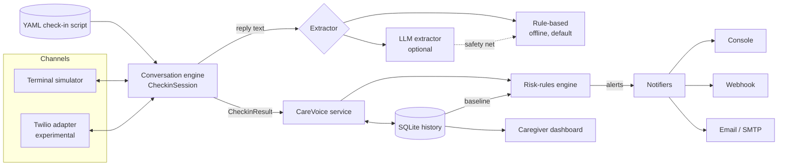
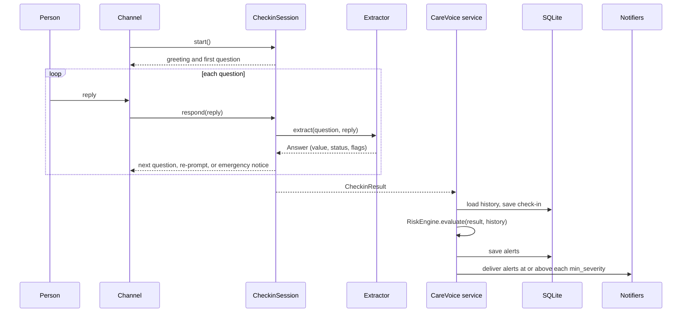

# Architecture

| Module | Responsibility |
| --- | --- |
| `care_voice.script` | Loads and validates YAML check-in scripts. |
| `care_voice.engine` | Runs one check-in turn by turn, with re-prompts, follow-ups, silence handling, and call retries. |
| `care_voice.extractors` | The `Extractor` interface, the rule-based extractor, and the LLM extractor. |
| `care_voice.risk` | The rules that turn a check-in and its history into alerts. |
| `care_voice.store` | SQLite storage for check-ins, transcripts, and alerts. |
| `care_voice.notifiers` | Console, webhook, and email delivery. |
| `care_voice.service` | Wires storage, rules, and notifiers together. |
| `care_voice.dashboard` | The caregiver web page and JSON API, built on the standard library. |
| `care_voice.telephony` | The `VoiceAdapter` interface and the experimental Twilio adapter. |

The core only ever sees text. Speech recognition and text-to-speech stay with the voice provider, so the extractor and the rules behave the same in the simulator and on a real call.

## Data flow of one check-in

## Release artifacts

Every `v*` tag runs the release workflow, which builds:

- the wheel and sdist, published to [PyPI](https://pypi.org/project/care-voice/);
- standalone PyInstaller executables for Linux x64 and arm64, macOS arm64 and x64, and Windows x64;
- a multi-arch container image, `ghcr.io/superintelligenceco/care-voice`, signed with cosign;
- an SPDX SBOM, `SHA256SUMS`, and build provenance attestations for every file.

Verify a downloaded file with `gh attestation verify <file> -R superintelligenceco/care-voice`.

See the [decision records](adr/index.md) for why the pieces look the way they do.
